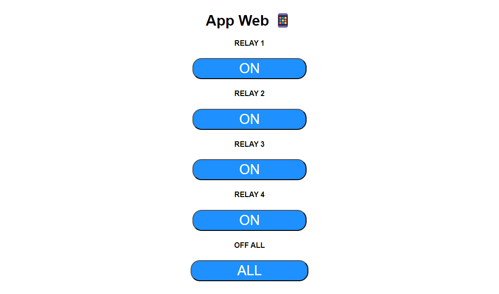

# Automacao Residencial Via Servidor Local

Este é um projeto simples que permite o controle de equipamentos eletrônicos com módulo relé e chip esp32 através de um servidor local, onde é possivel ligar e desligar relés com um app web no celular ou desktop, e para isso é preciso ter uma rede wifi (Sem necessariamente ter acesso a intenet).

#### Altere os dados necessários
Algumas parte do código devem ser modificadas de acordo com a sua necessidade.

Não é preciso adiconar as credenciais de rede WiFi no código, pois o mesmo possui o WiFi Manager onde o código está no arquivo ``WiFiConfigESP.ino`` mantenha-o na mesma Sketch (Pasta) para poder funcionar. O WiFiManager permite configurar a rede WiFI sem a necessidade de alterar o código, muito útil caso precise levar o projeto para outro lugar, para resetar o WiFi adicione um botão e altere o número da porta na variável ``#define BUTTON_RESET_WIFI       17 ``, neste caso esta na porta 17 do esp32, para resetar a rede Wifi mantenha o botão precionado por 3 segundos até abrir o acesso point de configuração WiFi, toque na rede para configurar, ao abrir a pagina click em ``Configure WiFi`` e por fim selecione a rede WiFi desejada e insira a senha e click em ``Save``. Para mudar a senha repita o procedimento.

O WiFi é configurado pela função `` wifiConfigESP();`` no setup e o reset em ``changeNetwork();`` no loop.

Nesta parte do código são as variáveis de auxílio de texto, que por padrão está em "OFF", este é o texto que vai aparecer no seu app indicando que os relés estão desligado, ao clicar nos botões esse "OFF" irá mudar para "ON". Essas variáveis são nomeadas de ``TEXT_STATE_1``(Rele1), ``TEXT_STATE_2``(Rele2), ``TEXT_STATE_3``(Rele3), neste caso foi utilizado apenas três relés, então caso tenha necessidade de aumentar o número de relés adicione mais obedecendo a numeração ``TEXT_STATE_N``.
````
String TEXT_STATE_1 = "OFF";
String TEXT_STATE_2 = "OFF";
String TEXT_STATE_3 = "OFF";
String TEXT_STATE_4 = "OFF";
````

Nesta parte é definida as variáveis de saída, que são nomeadas com um mone e em seguida do simbolo de `=` temos o numero da GPIO da placa que é a numeração do pino de saída, consulte as especificações da placa e mude de acordo, neste caso são  ``RELAY_PIN_1``(Rele1), ``RELAY_PIN_2``(Rele2) e ``RELAY_PIN_3``(Rele3) seguindo sempre a ideia inicial, caso seja necessário adicionar mais relés, adicione obedecendo a numeração ``RELAY_PIN_N``(ReleN). Como complemento, mas opcional, foi adicionado um led na saída 25 para indicar que a placa está conectada a rede. 
````
#define RELAY_PIN_1             18       //Relay Pin 1
#define RELAY_PIN_2             19       //Relay Pin 2
#define RELAY_PIN_3             23       //Relay Pin 3
#define RELAY_PIN_4             05       //Relay Pin 4
#define WIFI_LED                25       //Network LED indicator pin

````

Anteriomente definidos os pinos de saída, agora será definida como pinos de saída ``OUTPUT``, isso quer dizer que todos os pinos aqui funcionarão como saída, segue a ideia anterior, declare todos que forem adicionados. 
````
  pinMode(RELAY_PIN_1, OUTPUT);
  pinMode(RELAY_PIN_2, OUTPUT);
  pinMode(RELAY_PIN_3, OUTPUT);
  pinMode(RELAY_PIN_4, OUTPUT);
  pinMode(WIFI_LED, OUTPUT);

````

Já nesta parte define-se as saídas vão iniciar ligados ou desligados, por se tratar de módulo relé deve iniciar desligados ``HIGH``, já o led deve iniciar desligado ``LOW``.
````
  digitalWrite(RELAY_PIN_1, HIGH);
  digitalWrite(RELAY_PIN_2, HIGH);
  digitalWrite(RELAY_PIN_3, HIGH);
  digitalWrite(RELAY_PIN_4, HIGH);
  digitalWrite(WIFI_LED, LOW);

 ````
 
 Nesta parte requer pouco de ateção, pois aqui é a parte de comandos de liga/desliga e alteração de estados de texto de "OFF" para "ON", ou seja ao clicar no botão RELAY 1 será enviado um comando para ligar o relé e ao mesmo tempo muda a variável ``TEXT_STATE_N`` declarada no incio do código como "OFF" passa a ser "ON", ao clicar no mesmo botão esse processo se inverte. na parte `` if (header.indexOf("GET /relay1/on") >= 0)`` e ``else if (header.indexOf("GET /relay1/off") >= 0)`` mude o `relay1` pelo numero do rele, seguindo a respectiva ordem, relay1, relay2, relay3, relay4 e relayN, repita isso para cada relé nas duas funções, pois é uma para ligar ``GET /relay1/on`` e outra para desligar ``GET /relay1/off``. Adicione esse conjunto de funções de acordo com o número de relés, alterando as variáveis ``relayN`` ``TEXT_STATE_N`` e ``RELAY_PIN_N``.
 ````
            //relay 1
            if (header.indexOf("GET /relay1/on") >= 0) {
              Serial.println("Relay 1 on");
              TEXT_STATE_1 = "ON";
              digitalWrite(RELAY_PIN_1, LOW);
            } else if (header.indexOf("GET /relay1/off") >= 0) {
              Serial.println("Relay 1 off");
              TEXT_STATE_1 = "OFF";
              digitalWrite(RELAY_PIN_1, HIGH);
            }
  ````
Nesta parte é uma função para desligar todos os relés de uma vez, e ao mesmo tempo altera o estado da saída de todos os relés para desligado ``OFF``
````
            //Off All
            else if (header.indexOf("GET /off-all") >= 0) {
              Serial.println("All relays off");
              TEXT_STATE_1 = "OFF";
              TEXT_STATE_2 = "OFF";
              TEXT_STATE_3 = "OFF";
              TEXT_STATE_4 = "OFF";

              digitalWrite(RELAY_PIN_1, HIGH);
              digitalWrite(RELAY_PIN_2, HIGH);
              digitalWrite(RELAY_PIN_3, HIGH);
              digitalWrite(RELAY_PIN_4, HIGH);
            }

````
Nesta parte é a formatação Html da página web, altere de acordo com sua necessidade, como por exemplo a cor do botão em estado off (Azul) ``.button { background-color: #1E90FF; `` altere o código Hexadecimal, e o botão em estado on (cinza) ``.button2 {background-color: #555555;`` ou o título do app ``"<body><h1>Home Automation </h1>"``.
````
client.println("<!DOCTYPE html><html>");
client.println("<head><meta name=\"viewport\" content=\"width=device-width, initial-scale=1\">");
client.println("<link rel=\"icon\" href=\"data:,\">");
client.println("<style>html { font-family: Helvetica; display: inline-block; margin: 0px auto; text-align: center;}");
client.println(".button { background-color: #1E90FF; border-radius: 20px; color: white; padding: 4px 100px;");
client.println("text-decoration: none; font-size: 30px; margin: 2px; cursor: pointer;}");
client.println(".button2 {background-color: #555555;}</style></head>");
client.println("<body><h1>App Web &#128241;</h1>");

````
E por fim a parte onde é desenhado os botões e alternancia de seu estado no app web, adicione esse conjunto de funções de acordo com o número de relés, seguindo sempre a lógica inicial. Altere ``RELAY_PIN_N``, ``TEXT_STATE_N`` e ``relayN/on`` e ``relayN/off`` 

````
            //Relay 1
            client.println("<h4>RELAY 1</h4>");
            if (TEXT_STATE_1 == "OFF") {
              client.println("<p><a href=\"/relay1/on\"><button class=\"button\">ON</button></a></p>");
            } else {
              client.println("<p><a href=\"/relay1/off\"><button class=\"button button2\">OFF</button></a></p>");
            }
````

**ℹ️Ao final teremos algo assim:**

